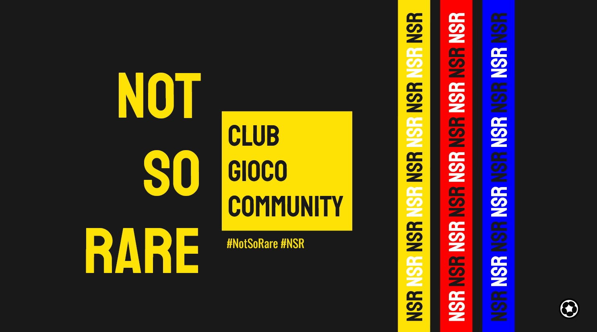

# NotSoRare Project

## Mission Statement
Starting in the Italian market, we aim to create a community geared towards supporting:
- Rookie players with passive interest in the game, 
- Involved players with an average budget between 500 $ to 2,000$ and 
- Financially-focused players looking for significant ROI.

We aim to foster organic community growth, by providing a mixture of data-driven advice & engaging community content. Our offerings “line-up” is composed of:
- Model-based approach to scout & determine the best players for each game week and those most likely to grow in value;
- Professional and engaging digital content and entertainment (twitch, telegram, discord, IG, twitter etc.) about Sorare, with a hierarchical loyalty program based on the resources at the user's disposal;
- Putting our own skin in the game, leveraging our algorithms to trade and compete in several leagues ourselves, depending on the total initial budget.

## Codebase and APIs
This repository will contain the initial codebase for access to the Sorare API, as well as further access to various Football APIs that we attemptp to leverage to derive player statistics. 
Currently, the APIs that will be used are:
- Sorare API 
- Football API